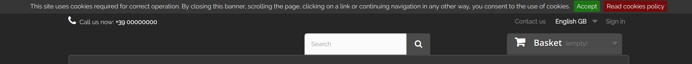
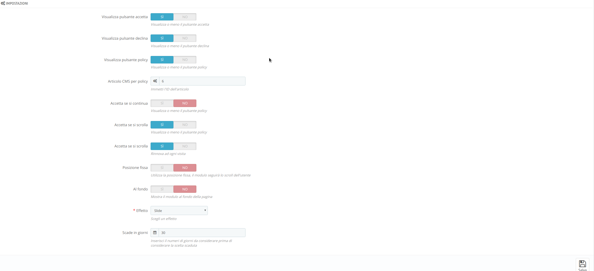

# EuCookieSmart

EuCookieSmart is a  [PrestaShop](https://www.prestashop.com/it) module for display a cookie law banner.

## Features

  * link a cms item as cookie policy
  * show/hide accept button
  * show/hide decline button
  * show/hide policy button
  * configure expiration days
  * accept on continue
  * accept on scroll
  * display top/bottom
  * change effect (slide, fade, hide)
  * Built-in languages (italian, english)
  
### Preview
#### Front office

#### Back office

## Compatibility
Tested with PrestaShop 1.6.x and 1.7.x.

## Credits

### Logo 

Icons made by <a href="https://www.freepik.com/" title="Freepik">Freepik</a> from <a href="https://www.flaticon.com/"  title="Flaticon">www.flaticon.com</a> is licensed by <a href="http://creativecommons.org/licenses/by/3.0/"  title="Creative Commons BY 3.0" target="_blank">CC 3.0 BY</a>

